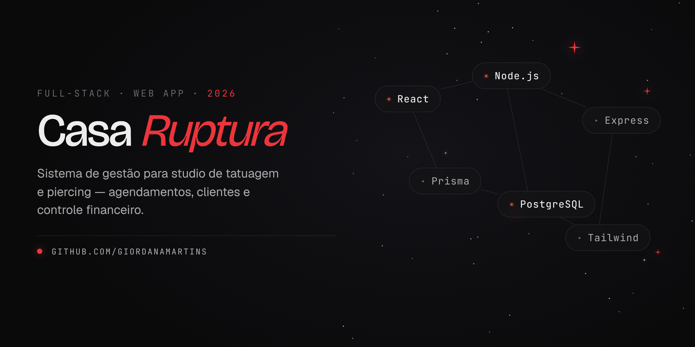
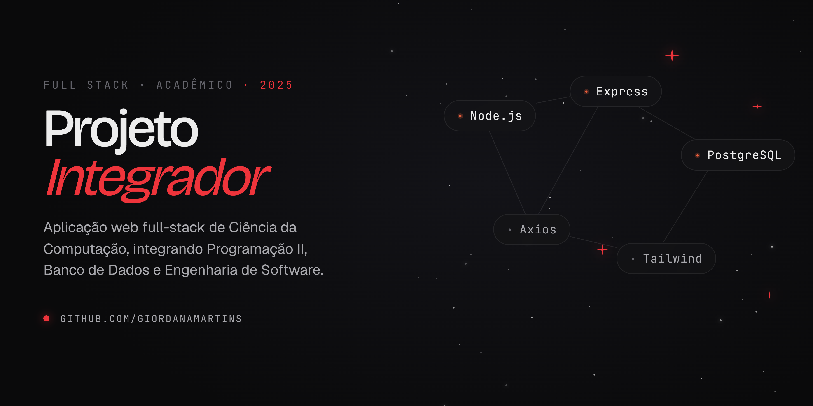

# Hi, I'm Giordana 👋

**Full-Stack Developer** with a strong frontend focus.

At **Abensoft**, I work on **Superleme**, a real estate management platform built with **Elixir/Phoenix, Inertia.js, React, TypeScript and Tailwind**. There I lead the frontend architecture, own the shared component library and the coding standards the whole team builds on, while also contributing across the backend.

🎓 B.Sc. in Computer Science @ UFFS

---

## 🛠️ Tech Stack

---

## 🚀 Featured Projects

### Casa Ruptura

Management system for a tattoo & piercing studio — scheduling, clients, and financial control.

`React` · `Vite` · `Tailwind` · `shadcn/ui` · `Node.js` · `Express` · `Prisma` · `PostgreSQL`

### Projeto Integrador

Full-stack Computer Science web application integrating Programming II, Databases, and Software Engineering.

`Node.js` · `Express` · `PostgreSQL` · `Axios` · `Tailwind`

---

## 📚 Currently Exploring

- Scalable frontend architecture & design systems
- Testing strategies — unit and integration
- Advanced TypeScript patterns & clean code

---

## 🌐 Find Me

